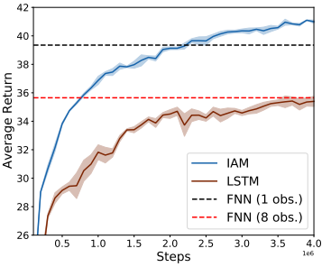

# Introduction
<!--Erik-->
In this blog, we are going to tell about the IAM [^iam-paper] paper and how we tried to reproduce some results of that paper.
The title of the IAM paper is Influence-aware memory architectures for deep reinforcement learning and authored by Miguel Suau et al.
The idea of the project was to reimplement the IAM model with a different library and to reproduce some results given in the paper.
The main idea of the paper is to propose an architecture where the agent has some influence-aware memory (IAM).
The agent makes its decisions based on a reinforcement learning model.
With this architecture, it is then possible to remember the useful information from the environment while alleviating the training difficulties compare to conventional methods using RNNs.
The goal of the paper is to show that architecture indeed has an important effect on convergence, learning speed and performance of the agent.
We reproduced the implementation and repeated some of the experiments described in the paper to see if we got some similar results. 
The design of the IAM described will be explained in greater detail in the next section.
After that, we will dive into our implementation and the results we got from that implementation. 
At last, we discuss our results in a comparison with that of the paper and give a short conclusion of the project.
*Write about Reinforcement learning*
*What the author wanted to achieve*
*How the environment works*

# The design of IAM
As introduced in the introduction the IAM stands for influence aware memory, meaning that the architecture is intended to only remember relevant parts of the environment. 
This is done by letting the RNN focus on a fraction of the environment or observations. 

The model is used with an agent that uses reinforcement learning (RL). 
In reinforcement learning, the main characters are the agent and the environment. 
The environment is the place where the agent makes observations and with which it interacts. 
Each iteration the agent sees an observation of the state of the environment, based on these observations the agent makes decisions out of a certain set of possible actions. 
This way the agent moves or interacts with its environment and get its rewards. 
This reward tells the agent how good it is performing. 
The goal of reinforcement learning is to get an agent that gives a high reward i.e. performs well. 

The actual RL algorithm which is used to train the model is PPO. 
This algorithm focuses on taking the biggest steps possible to improve, without stepping so far that the performance suddenly collapses. 

Now having explained the RL part of the system let’s discuss the IAM model.

# Implementation in Pytorch
<!--Gijs-->
The IAM model for the Warehouse environment is relatively simple to create. 
However, some information in the paper is missing which took more time to figure out.
In short, we have taken these steps to reproduce the paper: Selecting a similar PPO algorithm, 
adapting the Warehouse environment to work with OpenAI Gym and
combine a FNN with GRU in parallel to create the IAM model.

Our parameters should be the same as in the paper following the default PPO settings. 
However, after generating all the results we found out that the paper uses a ppo epoch of 3
and our implementation 4. This can affect the output, but we are not comparing the absolute results, only the relative results to the baselines so this is less of a problem.
Also, our GRU model does not have an FNN as first layer which would have been better for comparison in hindsight.

### PPO algorithm
The author implemented his own PPO algorithm, we choose to use an algorithm based on OpenAi PPO from this [repo](https://github.com/ikostrikov/pytorch-a2c-ppo-acktr-gail.).
The code already had some structure for a recurrent network namely the GRU, this why we created our IAM with a GRU instead of an LSTM. 
Using the GRU will change the results compared to the paper, but we can still relate the performance of the IAM model to a single GRU.
### Warehouse
The Warehouse environment is created by the author himself. It contains one agent in a 7x7 grid which needs to collect items at boundaries of the grid to receive a reward.
These items appear at random and disappear after 8 seconds, so the model needs some kind of memory to save this information for multiple timesteps.  

  
*Warehouse visualization. (blue) agent, (yellow) items.*

Fortunately, the code is available on Github, and so we could easily copy the environment.
The environment is also clearly explained in the paper, so we could have created it ourselves.

Two small adjustments have been made to get the environment working with the PPO algorithm:
- The observation space property with the correct output was added
- Metadata property set to None

## IAM model
As described in the paper the basic IAM model for the Warehouse environment uses an FNN and GRU in parallel. 
The paper didn't explain how the IAM model was used in the PPO algorithm. This is an important detail since the algorithm uses an actor and critic model, and these can be used in different combinations. 
For example parts of the model used in the actor and critic can be shared or completely separate. We decided to use two instances of the IAM model, one as actor and one as critic.  
  
*Diagram of the IAM model from Figure 3 of the paper.*
### Baselines
Since we use a different PPO model as the original paper, to compare the results correctly,
the baselines used in the paper are also implemented, again using two instances of the model for actor and critic:
- A single FNN of two layers with one or eight observations as input. With hidden sizes to be the same as in the paper: 640,256.
- A single GRU. Containing just one layer of 128 parameters. 

# Results
<!--Erik-->
<!--Zou je misschien kunnen kijken hoe we een legenda kunnen toevoegen aan de plots?-->

*Focused on reproducing Figure 5 of the paper
Minibatch of 8 with four different models

Notice that FNN 1 obs gives the best results.
We do see that FNN 8 obs performs worse just as in the paper.
FNN 1,8 and GRU on average took less than 4 hours. While IAM took 5 hours.
Minibatch of 32 for just GRU and IAM again showing better results. We ran a minibatch of 32 after we found out we could run it on Linux with 32 processes

The paper claimed that GRU or LSTM are less stable but actually our results show that GRU is very stable.*

*Figure 5 of the paper*

# Reproducibility
<!--Gijs-->
Overall, the information from the paper was sufficient to implement the model described. 
But as also discussed earlier the paper does miss some important details.  
When creating the plots of our result and comparing it to Figure 5 of the paper, we noticed that information was missing on how the graphs were created in the paper.
These are the scale of the reward (can be guessed to be multiplied by 100), 
the amount of timesteps used in the rolling average and
how many training runs have been used to find the variation. Luckily, the author replied quickly to our emails to give this additional information and this adds to the reproducibility factor as is mentioned here [[1]](#1).

Also, some other inconsistencies were found in the paper and appendix reducing the reproducibility.
- The observations used in the FNN were different in the paper (8) and the appendix (32).
- The size of each model should be equal according to the appendix but that LSTM is described to have 128 less neurons.
- We were also not sure what to do with the time horizon parameter as it isn't explained anywhere in the paper.

# Conclusion
<!--Gijs-->
The reproducibility of the paper was good. Some information was missing, but the author quickly responded to any of our questions.
We did however see different results than the author was claiming. The IAM network containing the FNN and GRU did not have a higher performance than just a single GRU. 
On average the GRU performed slightly better, and the training time was also 20% faster compared to the IAM network. 
Our intuition tells us that this is because the GRU model has much fewer parameters than the IAM network. 
In hindsight, after all the results had been created, it would have been better to have the same number of parameters for each model for a better comparison. 
This is also mentioned in the paper.

We do want to note that we did not do any experiments with the Atari environments because of the long training time and the author does claim that 
the advantage of the IAM model becomes more apparent when increasing the dimensionality of the problem. That's, for future work.

## Links
Authors implementation: https://github.com/INFLUENCEorg/influence-aware-memory  
Paper: https://arxiv.org/pdf/1911.07643.pdf  
PPO implementation used: https://github.com/ikostrikov/pytorch-a2c-ppo-acktr-gail

## References
<a id="1">[1]</a> 
Raff, E. (2019). A Step Toward Quantifying Independently Reproducible Machine Learning Research. NeurIPS.